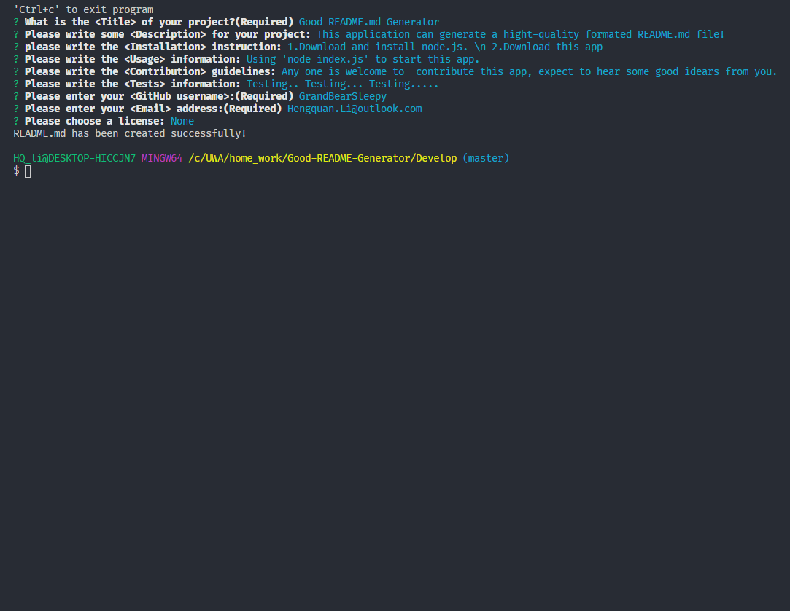

# Good README Generator

## Project description
    This application can generate a hight-quality formated README.md file!

Video link:https://drive.google.com/file/d/1K8t9T2juUZ0ARHzFmW7Vlv-LIjNW_deS/view

## Table of Contents
* [Installation](#installation)
* [Usage](#usage)
* [Contributing](#contributing)
* [Tests](#tests-information)

## Installation
    1.Download and install node.js.
    2.Download this app

## Usage
    Using 'node index.js' to start this app.

## Contributing
    Any one is welcome to  contribute this app, expect to hear some good idears from you.

## Tests information
    Testing.. Testing... Testing.....

## Author information
  GitHub: https://github.com/GrandBearSleepy

  Email-address: Hengquan.Li@outlook.com

